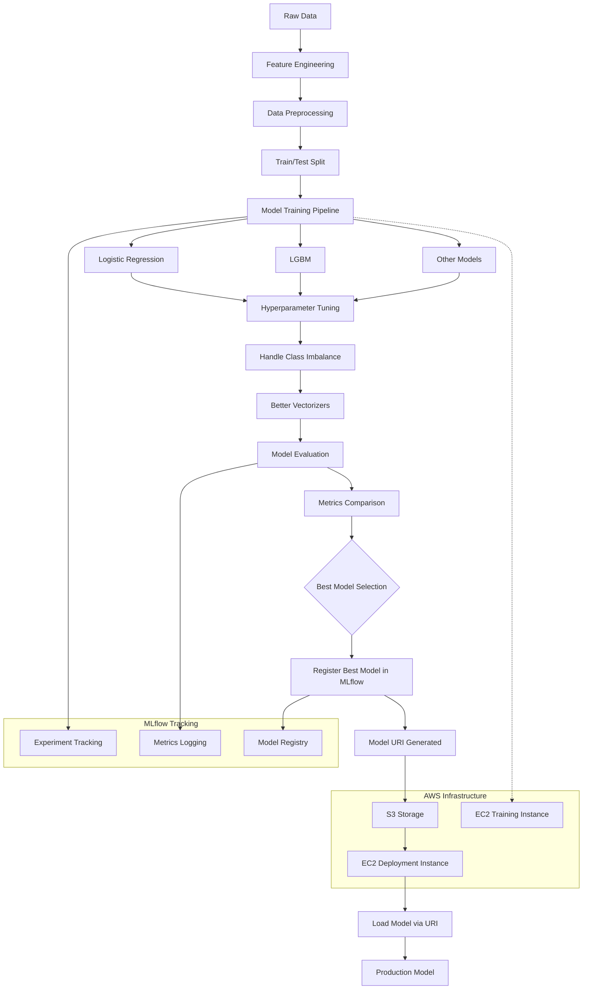
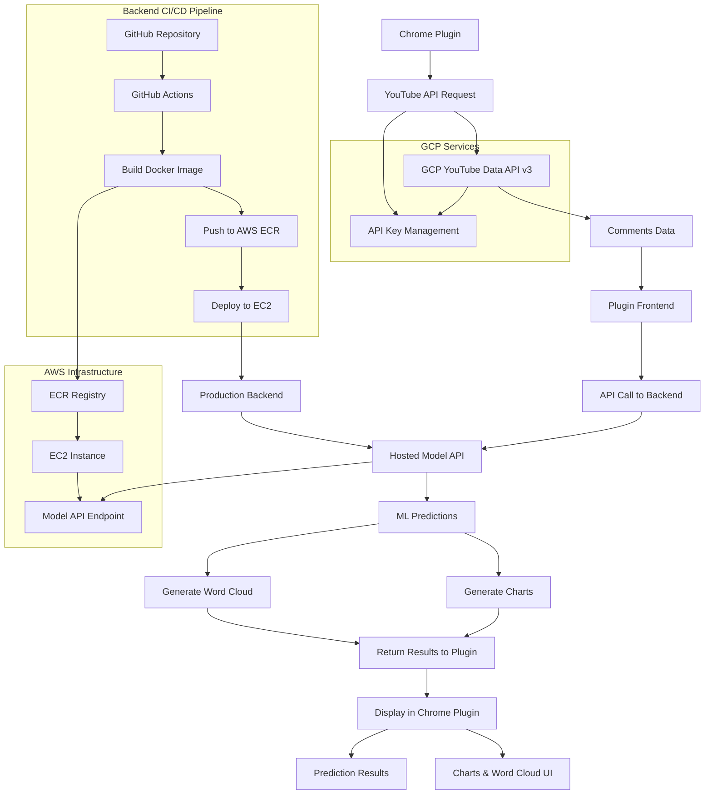

# YtMoodLens

A real-time YouTube sentiment analysis tool that leverages MLOps principles to analyze the emotional tone of YouTube comments through a browser extension.

https://github.com/user-attachments/assets/26715a49-6f11-4529-b7b8-b7f10d2d3a14

---

## Model Training Flow

--- 

## Overview

YtMoodLens targets MLOps principles by implementing a complete machine learning pipeline that trains models with improved methodologies through systematic experiments. The models are stored in S3 via MLflow for version control and model management, then loaded and served on EC2 instances for real-time inference.

## Architecture

- **Model Training & Experimentation**: Advanced training methods with experiment tracking with mlflow
- **Model Storage**: Models stored in S3 using MLflow for versioning and artifact management
- **Container Registry**: ECR (Elastic Container Registry) for Docker image management
- **Deployment**: Served on EC2 instances for scalable inference
- **Data Source**: YouTube API from GCP for comment extraction
- **Frontend**: Browser extension providing near real-time sentiment analysis

---

## Flow Diagram

---

## Features

- Real-time sentiment analysis of YouTube comments
- MLOps-driven model development and deployment pipeline
- Scalable cloud infrastructure on AWS
- Browser extension for seamless user experience
- Integration with Google Cloud Platform's YouTube API

## Technology Stack

- **Cloud Platform**: AWS (EC2, S3, ECR)
- **ML Platform**: MLflow for experiment tracking and model management, DVC for versioning
- **API**: YouTube Data API v3 (Google Cloud Platform)
- **Frontend**: Browser extension (Chrome/Firefox compatible)
- **Containerization**: Docker with ECR

## Special Thanks

Special thanks to [dswithbappy](https://github.com/entbappy) for this project.
